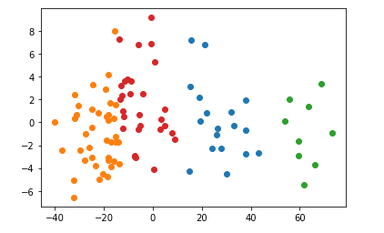

# An Data Science Look into Hip-Hop from 1980-2020

DSC160 Data Science and the Arts - Midterm Project Repository - Spring 2020

Project Team Members: 
- Mizuki Kadowaki, mikadowa@ucsd.edu
- Anurag Pamuru, anpamuru@ucsd.edu
- Shutong Li, shl636@ucsd.edu
- Rakesh Senthilvelan, rsenthil@ucsd.edu
- Praveen Nair, prnair@ucsd.edu

## Abstract

(10 points) 

For this project, we are going to analyze a broad group of influential hip-hop songs from the 1970s to today. The goal of the project is to cluster hip-hop songs based on a variety of audio features to quantify their similarities and differences, and to determine whether popular terms for classifying hip hop (based on factors like period, geography, and subgenre) are visible in these audio features. Our hypothesis is that artists and songs that share these sorts of qualitative similarities will also be considered more similar in audio analysis, but also that stylistic groupings (such as soul rap and trap music) will be stronger than identity-based groupings (for example, East vs. West Coast).

In order to conduct this analysis, we will use the Python package librosa, which will allow us to extract features such as mel-frequency cepstral coefficients (MFCC’s), chroma features, zero crossing rate, and other spectral features. Then, using a dimensionality reduction technique such as PCA, we can use the package sklearn to cluster and classify our data based on the extracted features. The results of this clustering should be available as graphs based on the dimensional reduction, within which we can make distinctions for different clusters. This project expands on the feature extraction we did in class by harnessing the domain knowledge we have about hip-hop classification and history to determine whether the sorts of classifications that listeners of hip-hop make have an underlying basis in measurable audio features. This analysis is also valuable in that it provides a quantitative way to understand high-level trends in hip-hop from its inception until today, and to also understand what previously unrecognized similarities there might be between works that we would previously not associate together.

## Data

(10 points) 

The cultural data source we went with is a the top 2 hip-hop songs for each year from 1980 to 2020 as streamed on Spotify, a music streaming application. Alongside all of these songs, we added in songs from influential artists such as Kanye West, Jay-Z, 2Pac, and Travis Scott who did not show up on the Spotify data in order to further show differentiable features of different eras of music within the eras and account for highly influential figures in the era who were very popular during the years analyzed but do not perform as well on Spotify. The dataset was made on May 1, 2020 by drawing from the Spotify API and manual research done on different highly influential artists in the genre. The manual data analysis largely draws from Billboard charts from the years 2002 to 2020 and research on hip-hop centric websites such as VH1. The works were created by a wide variety of hip-hop artists who produced the music between 1980 and 2020. The dataset encompasses numerous subgenres and styles within hip-hop through the artists represented within the set. The music is all digital native: it has been recorded and released in the form, which allows for more accurate analysis of the audio data that will be drawn from these songs for this project. The music itself was extracted from YouTube using [youtube-dl](https://github.com/ytdl-org/youtube-dl). In the /data/ subfolder, however, since it would be undesirable to put all the songs up on GitHub, we instead just used a csv of the extracted features, [full_data.csv](https://github.com/ucsd-dsc-arts/dsc160-midterm-group-8/blob/master/data/full_data.csv).

## Code

(20 points)

Link each of your notebooks or .py files within this section, and provide a brief explanation of what the code does. Reading this section we should have a sense of how to run your code.

Data acquisition and cleaning is handled by the [feature_extraction.ipynb](https://github.com/ucsd-dsc-arts/dsc160-midterm-group-8/blob/master/code/feature_extraction.ipynb). This code first utilizes Spotify's API in order to obtain streaming data on hip-hop songs released between 1980 and 2020. *This notebook isn't runnable* because it requires use of Spotify's API, as well as the local song data downloaded earlier. Using the JSON data, it is formatted into a Pandas Dataframe. The first cleaning step was to replace any duplicate songs. Then, we needed to replace any songs that were not hip-hop, as Spotify tended to mix in R&B and funk songs into the mix as well, with the 3rd most popular song in the genre from that year. To further develop the dataset, we added in songs that were very representative of hip-hop in their years but did not make the Spotify list: songs by artists such as Kendrick Lamar, Kanye West, Jay-Z, 2Pac, Dr. Dre, Travis Scott, Lil Pump, Lil Nas X, and Pete Rock. Using Spotify's built-in API, we then extracted audio features with the purpose of augmenting future features. From here, we started matching audio files with their respective entries in the dataset then created a function to get features such as MFCCs, chroma features, zero crossing rate, spectral bandwidth, spectral centroid, and spectral rolloff. Now, we had the dataset we needed to move forward.  

For analysis, in [music_PCA.ipynb](https://github.com/ucsd-dsc-arts/dsc160-midterm-group-8/blob/master/code/music_PCA.ipynb), we worked to look and see if there were any clusters, trends, or associations within the data. The first step taken was to use PCA dimensionality reduction to reduce the data to two dimensions. This was then graphed in order to generate the results that are discussed later on. Next, we used PCA again to reduce the data down further to one dimension that plots against song year to see if any associations could be related to the year of the song's release. Finally, in [code/bokeh_plots.ipynb](https://github.com/ucsd-dsc-arts/dsc160-midterm-group-8/blob/master/code/bokeh_plots.ipynb), we plotted the associations between the features we extracted from the songs using librosa tools as well as those given to us by Spotify's API. In this case, we developed a scatter matrix to display this. The results are discussed in the next section.

## Results

(30 points)

**Interactive versions of all charts are in [/code/bokeh_plots](https://github.com/ucsd-dsc-arts/dsc160-midterm-group-8/blob/master/code/bokeh_plots.ipynb).**

The following is the result of clustering the 1st and 2nd PCA dimension of our feature space. We set the number of clusters to 4 to represent the 4 different decades that the musics are from. The clusters, unsurprisingly, are not very  distinct, although we can see a clear central mass and variation in both dimensions (more distinct in dim1 than dim2).  

To compare the members of the clusters against the year they are published, we can see that cluster 2 and 3 has a seemingly higher exclusivity for musics from a certain time period (00-20s or 80-00s). The other two clusters have relatively higher variability in representing musics from different time period. 

This next plot uses PCA once again to reduce our data to one dimension, then plots that dimension against song year. We observe an association between the two. Subsequently, we verify the correlation with r = 0.232357, with a p-value of 0.022721.  

In order to determine some more usable insights, we compared the associations between all of the named features (the spectral features and Spotify's song attributes). This yields the following scatter matrix:

Here, we plot the progression of Spotify's loudness variable (measured in decibels) over time. We can see that loudness rises until it peaks in the 2000s, then begins to fall in the 2010s. This is consistent not only with popular beliefs about 2000s hip-hop, but also with the progression of the [loudness war](https://en.wikipedia.org/wiki/Loudness_war#2010s), a process whereby music recordings have consistently gotten louder over time, peaking in the mid-2000s. The outlier towards the bottom, by the way, is the Drake song "Marvins Room," which, to be honest, isn't really a hip-hop song, although Spotify tags it that way.

Here, we plot the progression of Spotify's tempo variable (measured in beats per minute) over time. We can see that the variation in tempo in popular music has increased drastically in the last decade, with an increasing number of hit songs using much faster beats. Once again, this is consistent with popular belief about older hip-hop, which tended to be more uniform and structured than many hip-hop tracks today. (Think about the standard cadence and rhythm in early hip-hop hits such as Sugarhill Gang's "Rapper's Delight" or Grandmaster Flash's "The Message.")

Here, we plot the progression of zero crossing rate, calculated with librosa, over time. We can see that zero crossing rate has tended to decrease over time. Zero crossing rate tends to correlate with sounds that are percussive, such as drums. This could be the consequence of an increasing diversity of beats being used as hip-hop developed, going from the more traditional beats found in early-80's tracks like "It's Tricky" by Run-D.M.C to the vocal samples and non-percussive instruments that are used more today. The highest zero-crossing rate is found with the Beastie Boys' "No Sleep Till Brooklyn," which uses a very intense guitar and drum-based beat.

Here, we plot the progression of spectral centroid, calculated with librosa, over time. There is a moderate negative relationship between time and centroid, indicating that the pitch of music has decreased, to some degree, over the last 40 years. Although this could be due to many factors, one could be the decreasing influence of funk (which features lots of high-pitched synth and electric guitar) on hip-hop. 

Once again, interactive versions of all of these plots are available at **[code/bokeh_plots](https://github.com/ucsd-dsc-arts/dsc160-midterm-group-8/blob/master/code/bokeh_plots.ipynb)**. Please run and look at this notebook -- it's a lot more interesting than any of these pictures (bokeh plots aren't embeddable in this readme or in the Github view of .ipynb files), containing analysis of some of the more interesting associations between the named features.

## Discussion

(30 points, three to five paragraphs)

As a first step to visualize the music from our dataset, we used the bokeh library for all of the named features (in other words, everything except for the MFCC and chroma features.)

We generated a dimensionality reduction of the data using PCA and plotted it with Bokeh, which allows us to interactively estimate the similarity between the collected features for different songs. We also used a one-dimensional PCA reduction and plotted against year in order to find a slight correlation between time period and the PCA features. However, as is always the case with dimensionality reduction (especially since we're using uninterpretable features like MFCC's), these analyses are limited because we don't really understand what exactly drives the similarities and correlations in the reduced dimensions. In order to fix this, we generated a series of plots based on the named, understandable features (the spectral features and Spotify's audio measures). We found a series of relationships over time with loudness, zero-crossing rate, tempo, and spectral centroid, which do provide some information on temporal trends in the hip-hop genre (such as decreasing use of percussive beats, increased variance in tempo, and the effects of the loudness war.)

Our computational approach to this differs from a lot of computational approaches to the topic as it is focused a lot on the audio data of hip-hop, rather than the lyrics. There are numerous blog posts that look into the lyrics of hip-hop and run analysis based off of those, but we have not seen many that look into the audio features. While there are many who subjectively go into the details of aspects of hip-hop song like beats, samples, etc., we have seen few who go into the audio features such as MFCCs and chroma features. There are, obviously, reasons for this. Hip hop is a mostly vocal art form, which means that any audio analysis is bound to be relatively messy, with fewer clear periodic and tonal differences than, say, classical music. While this sort of audio analysis is, to be sure, noninclusive of lyrics, the most important part of hip-hop, there are just as many musical changes in the genre over the measured period of time to make such an analysis worthwhile.

This analysis is culturally relevant in its representation of the diversity that exists within hip-hop, even within the relatively small subset we looked into within this project. There are numerous different subgenres of hip-hop that are represented within this dataset, and there are many more that exist that were not covered here like drill, crunk, and battle rap amongst others. It indicates that hip-hop is a genre that is incredibly diverse and a genre that is often not completely derivative of other things within that genre within the year. The type of analysis we did looking for clusters based on years might be more effective within each individual subgenre, but hip-hop as a whole is too diverse and unique. The results of this project, if anytbing, can also demonstrate the limits of data-based cultural analytics, that it's easy to miss the forest for the trees. Perhaps the songs we collected data about may not have had massive differences in the audio features we collected, but they are both culturally and emotionally significant to millions of people around the world, and each song was released and listened to in a variety of contexts that make them popular today.

We believe in the case of this analysis, original artists and musicians would most likely understand the results of this type of analysis as it indicates a diversity amongst the different songs released within each year. We do not believe that this data would change or inform their practice in any way as a result. This analysis could be broadened in the future with a larger dataset -- we only looked at a handful of songs, with no specific analysis based on any subgenres, cultural contexts, or regional origins. Adding these subjective data points into the analysis, as well as broadening the database to make it representative of the immense diversity of hip-hop, could lead to some more meaningful results, althouh the problems we listed above still remain. It would additionally be interesting to look into the different subgenres as mentioned before and see if any meaningful relationships can be found within them. For example, could there be noticeable trends in trap music? How did drill evolve over the years? How does a specific artist develop their sound throughout the different eras in their discography? These types of questions and more can be looked into for further research into this general topic. The possibilities are endless.

## Team Roles

Provide an account of individual members and their efforts/contributions to the specific tasks you accomplished.

- Praveen: Created dataset from Spotify API, downloaded data, extracted features, and visualized in Bokeh.

- Shutong: EDA, Dim reduciton, and clustering. 

- Rakesh: Data, Code, Results, and parts of Discussion section

- Mizuki: culture analysis, write up, research

- Anurag: discussion, write up, data

## Technical Notes and Dependencies

We used the library Spotipy, which requires access to Spotify's API in order properly run the project. You would also need to generate a Spotify API token in order to use the API -- we've cut ours out since it's private information, so the code/feature_extraction.ipynb notebook is not actually runnable right now. We also used Bokeh for visualization, Librosa for extracting audio features, scikit-learn for dimensionality reduction, and pandas for pretty much everything. There are a couple of external dependencies used for librosa's mp3 loading (ffmpeg for audioread), but since you won't need to run that notebook, it shouldn't be a problem. All code was run within Jupyter notebooks. 

## Reference

In addition to the lectures and exercises from this class that we used to direct the workflow of this project, we also utilized [Spotify's API documentation](https://developer.spotify.com/documentation/), [Spotipy documentation](https://spotipy.readthedocs.io/en/2.12.0/),[Bokeh documentation](https://docs.bokeh.org/en/latest/docs/reference.html), [Librosa documentation](https://librosa.github.io/librosa/), and [scikit-learn documentation](https://scikit-learn.org/stable/). We also couldn't have extracted the data without [youtube-dl](https://github.com/ytdl-org/youtube-dl).

In doing research on how our work differs from others, we consulted the following projects and people:

https://towardsdatascience.com/using-machine-learning-and-ai-to-understand-hip-hop-songs-evolution-e819c2a5172d

https://bjc.edc.org/Aug2016/bjc-r/cur/programming/old-labs/python/python_data_intro.html?topic=nyc_bjc%2FNA-python.topic

https://www.youtube.com/user/theneedledrop
